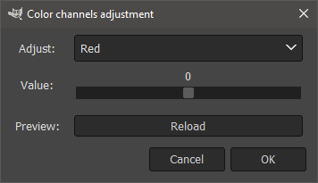

= Color channels adjustment

Color channels adjustment je plugin do GIMPu, který umožňuje upravit barevné kanály výběru z vybrané vrstvy. Krom barevných posunů jednotlivých barevných kanálů umožňuje úpravu jasu, kontrastu a saturace.

== Uživatelská příručka
Plugin ve formě python scriptu je ke stažení link:pupaldom_channels.py[zde]

=== Instalace
Instalace pluginu probíhá přesunutím scriptu do příslušné gimp složky pro pluginy. 

- Tento script byl vyvíjen pro *Gimp 2.10*.
- Cestu ke složce s pluginy je k nalezení v nastavení složek.
- V unixových systémech je zapotřebí zkontrolovat zda-li má script příslušná spouštěcí práva a případně je nastavit (`sudo chmod +x pupaldom_channels.py`).

=== Spuštění
Nainstalovaný plugin se nachází na horní liště pod záložkou *Filters* jako položka *Color channels adjustment (pupaldom)*. Kliknutím na tuto položku se plugin spustí ve formě dialogového okna, které vypadá takto.

V comboboxu je na výběr z 6 úprav, které se na RGB kanály aplikují intenzitou zvolenou na posuvníku. Pro dočasnou aplikaci úpravy obnovte náhled. Finální aplikaci úpravy potvrdíte tlačítkem *OK*. Úprava se aplikuje na vybraný výběr vybrané vrstvy. Na obrázku níže je ukázka všech 6 úprav, jak se zápornými hodnotami, tak i s kladnými hodnotami.

image::images/Showcase.PNG[width=100%]

== Technická Dokumentace
V této části popíšu stěžejní technické části programu.

=== Hlavní struktura
Podoba hlavní struktury programu vychází z ukázkových prací na cvičení a není tedy nijak více zajímavá. Za zmínku asi stojí struktura, která je využita, jak při generování UI, tak i ve volání správne funkce. Jedná se o list akcí s příslušnými referencemi na jejich metody.

[source, python]
----
actions = [
    ("Red", adjust_red), 
    ("Green", adjust_green), 
    ("Blue", adjust_blue), 
    ("Brightness", adjust_brightness), 
    ("Contrast", adjust_contrast), 
    ("Saturation", adjust_saturation)
] # list of actions with their corresponding methods
----

V metodě pro generování UI se tato struktura používá za cílem čistějšího kódu, který bude snadno rozšiřitelný.

[source, python]
----
self.combobox_selection = gtk.combo_box_new_text()
for a, f in self.actions: 
   self.combobox_selection.append_text(a)
self.combobox_selection.connect("changed", self.selection_changed)
self.combobox_selection.set_entry_text_column(0)
self.combobox_selection.set_active(0)
self.combobox_selection.show()
self.table.attach(self.combobox_selection, 2, 19, 1, 2)
----

V metodě pro aplikování akce, kde se iteruje přes pixely výběru specifické vrstvy, se tato struktura využívá pro elegantnější volání vybrané akce.

[source, python]
----
for i in range(0, bh):
    for j in range(0, bw):
        pos = (j + bw * i) * bpp

        arr_img = src_pxl[pos:(pos + bpp)]
        arr_rgb = gimpcolor.RGB(arr_img[0], arr_img[1], arr_img[2], arr_img[3] if bpp == 4 else 255)

        # apply selected action by accesing list of pairs
        arr_rgb = self.actions[self.action][1](self, arr_rgb, adjustment_value)

        arr_img[0:dst_bpp] = array.array("B", arr_rgb[0:dst_bpp])
        
        dst_pos = (j + bw * i) * dst_bpp
        dst_pxl[dst_pos:(dst_pos+dst_bpp)] = arr_img
----

=== Metody pro akce nad barevnými kanály
V metodě pro úpravu jednoho z barevných kanálů se postupuje velice jednoduše. K specifickému kanálu se triviálně přidá požadovaná hodnota. V kódu níže je metoda pro úpravu červeného kanálu.

[source, python]
----
def adjust_red(self, arr_rgb, adjustment_value):
    arr_rgb[0] = self.truncate_rgb(int(arr_rgb[0] + adjustment_value))
    return arr_rgb
----

V metodě pro úpravu světlosti barevných kanálů je daný pixel převeden do barevného prostoru HSV a následně je upraven _value_ kanál přidáním přeškálované hodnoty ze slideru.

[source, python]
----
def adjust_brightness(self, arr_rgb, adjustment_value):
    arr_hsv = arr_rgb.to_hsv()
    arr_hsv[2] = self.truncate_hsv(int(arr_hsv[2] + ((adjustment_value / 255) * 100)))
    arr_rgb = arr_hsv.to_rgb()
    return arr_rgb
----

Výpočet v metodě pro úpravu kontrastu byl inspirován touto https://www.dfstudios.co.uk/articles/programming/image-programming-algorithms/image-processing-algorithms-part-5-contrast-adjustment/[stránkou].

[source, python]
----
def adjust_contrast(self, arr_rgb, adjustment_value):
    temp = (259.0 * (255.0 + adjustment_value)) / (255.0 * (259.0 - adjustment_value))
    arr_rgb[0] = self.truncate_rgb(int((temp * (arr_rgb[0] - 128)) + 128))
    arr_rgb[1] = self.truncate_rgb(int((temp * (arr_rgb[1] - 128)) + 128))
    arr_rgb[2] = self.truncate_rgb(int((temp * (arr_rgb[2] - 128)) + 128))
    return arr_rgb
----

V metodě pro úpravu sytosti barevných se opět pixel převede do HSV prostoru a k _saturation_ kanálu se přičte přeškálovaná hodnota ze slideru.

[source, python]
----
def adjust_saturation(self, arr_rgb, adjustment_value):
    arr_hsv = arr_rgb.to_hsv()
    arr_hsv[1] = self.truncate_hsv(int(arr_hsv[1] + ((adjustment_value / 255) * 100)))
    arr_rgb = arr_hsv.to_rgb()
    return arr_rgb
----

=== Mergnutí pracovní vrstvy

Při potvrzení vybrané akce bylo zapotřebí mergnout pracovní vrstvu do výsledného obrázku, ale mergnutí všech vrstev do jednoho obrázku bylo nežádoucí. Proto byla využita funkce _gimp_image_merge_down_, která oproti _gimp_image_flatten_ a _merge_visible_layers_ nemergne všechny vrstvy, ale pouze výběrovou s pracovní.

[source, python]
----
def ok_clicked(self, button):
    self.apply()
    gimp.pdb.gimp_image_merge_down(self.image, self.layer, NORMAL_MODE)
----

==== Zdrojové kódy 
Zip se zdrojovým kódem naleznete link:res1.zip[zde].