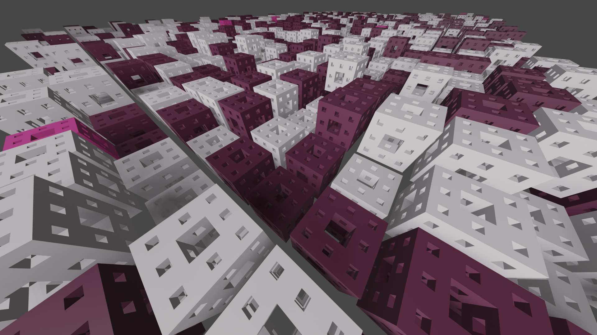

= Parameterized object generator - Menger sponge cubes (aneb pokus o umělecký kód)

Jedná se o plugin generující fraktálové kostky a to v lehce nastylizované mřížce po vzoru tohoto https://www.youtube.com/watch?v=r8hqLh_HE08&fbclid=IwAR3_nQuEDl_0_ETkUh_Xhw9OE53ERf0SvlZ6fXJ1uAcJtLP6V8UC9TOLAxY[videa]. Video mě inspirovalo již na samotným začátku této práce, ale původní verze s primitivními meshy mi přišla neadekvátní a rozhodl jsem se místo kostky použít kostku fraktálovou, konkrétně http://www.fundza.com/algorithmic/menger/index.html[Menger sponge].

== Uživatelská příručka
Plugin ve formě python scriptu je ke stažení link:pupaldom_fractcubes.py[zde].

=== Instalace
Tento script byl vyvíjen pro *Blender 2.91.0*. Instalace pluginu probíhá přes *Edit* -> *Preferences* -> *Add-ons* -> *Install*, kde po výběru staženého python scriptu je potřeba jej dodatečně zaškrtnout. 

=== Spuštění
Po nainstalování pluginu naleznete jeho funkcionalitu pod záložkou *Add* -> *Mesh* -> *Fractal cubes*. Kliknutím na tuto položku se vygeneruje samotný defaultní fraktál a společně s ním dialogové menu pro parametrizaci jak samotného fraktálu, tak i vlastností mřížky.

Parametry *Size*, *Location* a *Iterations* slouží k parametrizaci dílčího fraktálu, ze kterého se vygeneruje mřížka podle parametrů *Rows*, *Columns* a *Offset*.

WARNING: Opatrně se zvolenými parametry, na čtyři kostky s úrovní iterace 5 sotva stačí 16GB RAM!

=== Příklady

TIP: 2x2 grid fraktálů úrovně 5

TIP: 20x20 grid fraktálů úrovně 4

TIP: 50x30 grid fraktálů úrovně 3

== Technická Dokumentace
V této části popíšu stěžejní technické části programu.

=== Hlavní struktura
Podoba hlavní struktury programu vychází z ukázkových prací na cvičení a není tedy nijak více zajímavá. Typické je i použité UI, u kterého bych jenom zmínil prvek pro nastavení počtu iterací, kde je z důvodu paměťové náročnosti hodnota parametru *max* uměle omezená na hodnotu 6. Teoreticky tedy neexistuje vrchní limit tohoto algoritmu a u silnějších strojů není problém tento limit zvětšit.

[source, python]
----
iterations = bpy.props.IntProperty(
    name='Iterations', 
    description='Number of iterations', 
    default=3, 
    min=1, 
    max=6, 
    step=1
)
----

=== Konstrukce fraktálu
Metoda pro konstrukci fraktálu je rekurzivní a její princip je z malé kostky vytvořit kostku velkou. Pravidlo pro vytvoření velké kostky je jednoduché, prostřední kostky se vynechávají. Splněním koncové podmínky se vrací mesh primitiv kostky.

[source, python]
----
def construct(self, iterations, size, location):
    # the smallest cube is mesh primitive
    if iterations == 1:
        bpy.ops.mesh.primitive_cube_add(location=location, size=size)
        bpy.context.object.name = 'FractCube'
        return bpy.context.object
    
    # get smaller cube via recursive construction of fractal cube
    cube = self.construct(iterations - 1, size / 3, (location[0] - size / 3, location[1] - size / 3, location[2] - size / 3))
    
    # create larger cube
    for x in range(0, 3):
        for y in range(0, 3): 
            for z in range(0, 3):
                if (x == y == z == 0): continue # skip already existing cube
                if (x == y == 1) or (x == z == 1) or (y == z == 1): continue # skip non edge cubes
                
                temp = cube.copy()
                temp.data = cube.data.copy()
                temp.location = (
                    temp.location[0] + x * size / 3, 
                    temp.location[1] + y * size / 3, 
                    temp.location[2] + z * size / 3
                )
                
                bpy.context.scene.collection.objects.link(temp)
    
    # unify larger cube
    bpy.ops.object.join() 
    
    bpy.ops.object.mode_set(mode='EDIT', toggle=False)
    bpy.ops.mesh.remove_doubles() # merge double vertices
    bpy.ops.object.mode_set(mode='OBJECT', toggle=False)
        
    return bpy.context.object
----

=== Generování mřížky

Metoda pro vygenerování mřížky z objektu je jednoduchá, předložený objekt se duplikuje a posouvá v *x* a *y* osách. Osa *z* je posunuta o náhodnou hodnotu (škálovanou podle velikosti), která je nakonec vynásobena o umělou konstantu (mnou vybranou). Na základě náhody je jednotlivým objektům přiděleny materiály, který jsou vytvořeny v metodě _colormix()_.

Tato metoda je připravena pro případné rozšiřování pluginu, protože objekt předávaný v parametru nemusí nutně být fraktál, ale klidně i primitivní mesh.

[source, python]
----
def generate(self, object):
    c = self.colormix()
    
    for i in range(0, self.rows):
        for j in range(0, self.columns):
            if (i == j == 0): continue # skip already existing object
        
            temp = object.copy()
            temp.data = object.data.copy()
            temp.data.materials.append(c[2] if random.random() < 0.031 else c[1] if random.random() > 0.491 else c[0])
            temp.location = (
                temp.location[0] + i * (self.size + self.offset), 
                temp.location[1] + j * (self.size + self.offset), 
                temp.location[2] + random.random() * self.size * 17 / 13
            )
            
            bpy.context.scene.collection.objects.link(temp)
    
    object.data.materials.append(c[2] if random.random() < 0.031 else c[1] if random.random() > 0.491 else c[0])
    object.location[2] = object.location[2] +  random.random() * self.size * 17 / 13
    
    return bpy.context.object
----

=== Míchání barev

Metoda pro míchání materiálů vrací tuple o třech hodnotách. První materiál je zamýšlen jako nejčastější, kdežto poslední jako nejvzácnější. Opět se jedná o uměle vybrané hodnoty.

[source, python]
----
def colormix(self):
    base = bpy.data.materials.new("Base")
    base.use_nodes = True
    base.node_tree.nodes['Principled BSDF'].inputs['Base Color'].default_value = (0.13, 0.03, 0.07, 1)
    
    high = bpy.data.materials.new("High")
    high.use_nodes = True
    high.node_tree.nodes['Principled BSDF'].inputs['Base Color'].default_value = (0.97, 0.87, 0.93, 1)
    
    rare = bpy.data.materials.new("Rare")
    rare.use_nodes = True
    rare.node_tree.nodes['Principled BSDF'].inputs['Base Color'].default_value = (0.69, 0.06, 0.31, 1)
    
    return (base, high, rare)
----

==== Zdrojové kódy 
Zip se zdrojovým kódem naleznete link:res2.zip[zde].