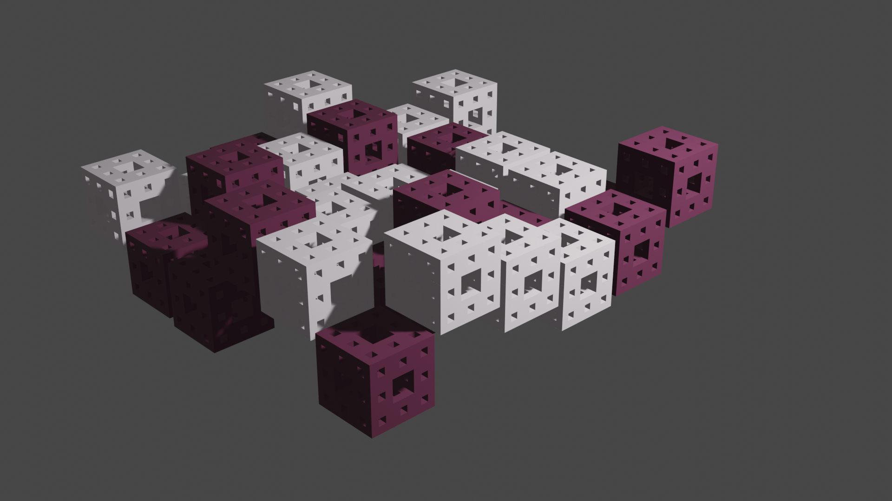

# BI-PGA
My solutions in python for the programming graphical applications university course

## 2D

*GIMP* plugin for adjusting the color channels.

## 3D

*Blender* plugin for procedually generating objects / code art attempt.

- The whole original documentation in czech - [here](index.adoc)
