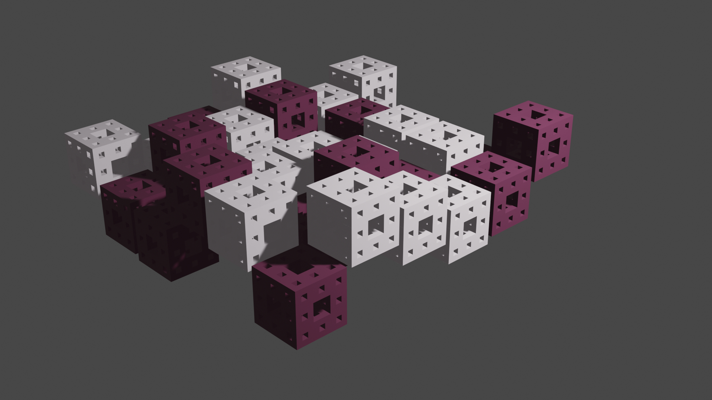

= Dokumentace

== 2D 
image::img1.jpg[width=100%]
*GIMP* plugin pro manipulaci barevných kanálů link:2D/dokumentace1.adoc[zde].

== 3D

*Blender* plugin pro generaci objektů / pokus o umělecký kód link:3D/dokumentace2.adoc[zde].

=== Zdrojové kódy 
Zip se všemi zdrojovými kódy naleznete link:resAll.zip[zde].

